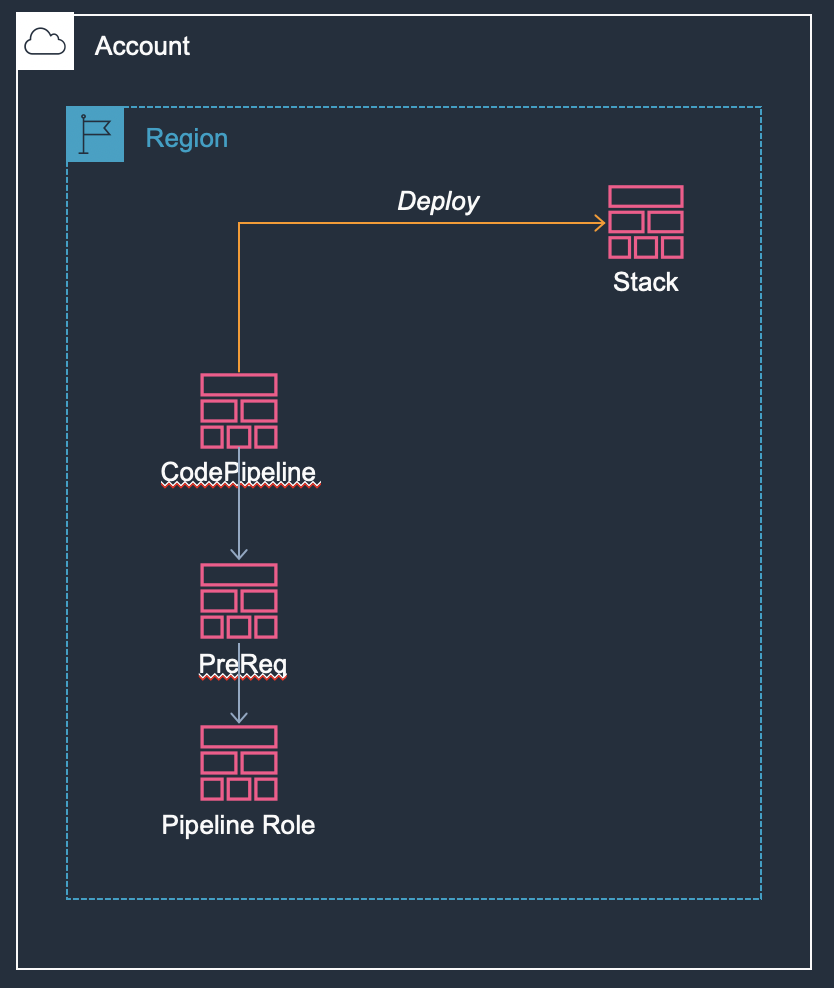
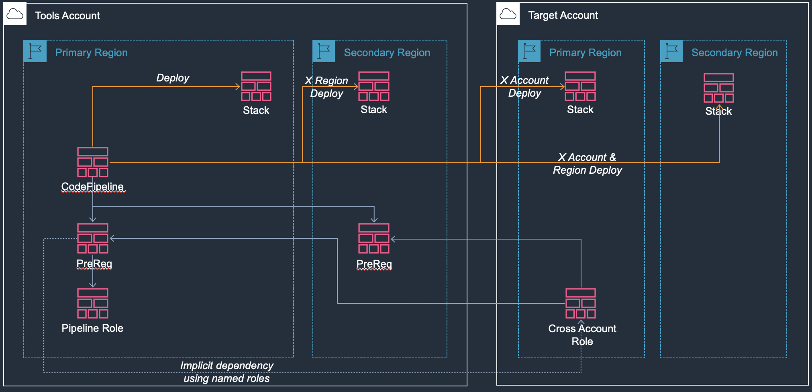

# Python SAM Application with Matrix CI/CD

This sample shows how to create python SAM application with "matrix" CodePipelines.

> Disclaimer: I use `cfn-cli` to deploy base CloudFormation templates but deploy using vanilla `aws-cli` or just Console is also ok, but in that case, I need copy stack outputs across region & accounts.

Highlights:

* Sample REST API developed using Flask and SAM.
* Codebase is separated from lambda environment thus can be developed & tested as a regular Flask application.
* Build and run lambda functions locally, with help from `sam-local`.
* Cross region, cross account CodePipelines.

Directory structures:

| Path                       | Description                                                  |
| -------------------------- | ------------------------------------------------------------ |
| `ci-base/`                 | CloudFormation templates for CI pipeline base infrastructure. |
| `ci-pipelines/`            | CloudFormation templates for CodePipelines.                  |
| `infra/lambda-layers/`     | CloudFormation template and scripts to build lambda layer.   |
| `services/todoapi/`        | CloudFormation template and wrapper code for TODOAPI service. |
| `src/todoapi/`             | TODOAPI codebase as a installable package, using `flask-restplus`. |
| `tests/ddb-local/`         | `docker-compose` file to launch a local DynamoDB for unittesting. |
| `tests/unit/test_todoapi/` | Unittests for todoapi, based on `Flask` unittest support.    |

## QuickStart

Note on project identifier: Each set of infra deployment share a unique project identifier to break circular dependency between cross-account role.

### Bootstrap Environment

Pre-requests (assuming a mac, but any recent Linux disto should work):

- Python 3.7 with pipenv
- Docker Desktop
- make
- md5sum

Goto project environment then run `make env` to create the virtual environment, then type `pipenv shell` to spawn a shell within the virtualenv:

```shell
> make env
...
Creating a virtualenv for this project…
Pipfile: ~/workspace/sample-python-sam-ci/Pipfile
Using /usr/local/bin/python3 (3.7.5) to create virtualenv…
...
Installing dependencies from Pipfile.lock (fe6386)…
  🐍   ▉▉▉▉▉▉▉▉▉▉▉▉▉▉▉▉▉▉▉▉▉▉▉▉▉▉▉▉▉▉▉▉ 96/96 — 00:00:46
To activate this project's virtualenv, run pipenv shell.
Alternatively, run a command inside the virtualenv with pipenv run.
All dependencies are now up-to-date!

> pipenv shell
Loading .env environment variables…
Launching subshell in virtual environment…
Welcome to fish, the friendly interactive shell
bob@bigmac ~/D/d/w/sample-python-sam-ci>  source /Users/bob/.local/share/virtualenvs/sample-python-sam-ci-AvXhpSn-/bin/activate.fish
(sample-python-sam-ci) bob@bigmac ~/D/d/w/sample-python-sam-ci> 
```

#### Optional: Update Package Lock

 `Pipfile.lock` and `requirements.txt` file contains last known good stable dependency, refresh these using:

```shell
> make update env layers
```

### Simple Setup

This is the most simple use case where the CI infrastructure and stacks are all deployed in a single account.



Pipeline only have a single deploy stage:

To deploy this, you'll need:

To deploy this, you'll need:

* An AWS Account with account id.
* AWS profile with administrator role.

First, open `cfn-cli.yaml` in editor, replace following string:

| Replace        | With                                                         |
| -------------- | ------------------------------------------------------------ |
| <profile-name> | AWS profile name, usually its `default`.                     |
| <account-id>   | AWS Account ID, you can retrieve this using: `aws --profile=<profile-name> sts get-caller-identity`. |

Then, deploy stacks using: 

```shell
> cfn-cli -f cfn-cli.yaml stack sync
```

The process may take ~10 minutes,  and following stacks are created:

| Stack Name                     | Region    | Description                                                  |
| ------------------------------ | --------- | ------------------------------------------------------------ |
| `solder100ci-roles`            | us-east-1 | Pipeline and CloudFormation roles for same-account deployment. |
| `solder100ci-prereq`           | us-east-1 | Source & artifact bucket for the pipelines.                  |
| `solder100ci-pipeline-layers`  | us-east-1 | CodePipeline to build, deploy lambda layer.                  |
| `solder100ci-pipeline-todoapi` | us-east-1 | CodePipeline to build and deploy todoapi service.            |

CodePipelines created by last two stacks:

| CodePipeline Name                            | Description                    |
| -------------------------------------------- | ------------------------------ |
| `Solder100-SameAccountSameRegionLambdaLayer` | Build and deploy lambda layer. |
| `Solder100-SameAccountSameRegionTodoApi`     | Build and deploy TODOAPI.      |

To tigger CodePipeline so start deployment, goto CloudFormation console, find  `solder100ci-prereq` stack, goto Outputs tab and find output value named `SourceBucket`, then, zip up the code base and copy it to the source bucket: 

```shell
> zip -x '.idea/*' '.git/*' '.env' '*.zip' '*/.aws-sam/*' -9 -FS source.zip -r .
> aws s3 cp source.zip s3://<SourceBucket>
```

This should trigger the pipelines starting deploy CI managed stacks:

| Stack Name          | Region    | Description   |
| ------------------- | --------- | ------------- |
| `solder100-layers`  | us-east-1 | Lambda layers |
| `solder100-todoapi` | us-east-1 | Todo API      |


Finally, goto CloudFormation console and discover deployed api stack endpoint, test todoapi using `curl`:

```shell
> curl -X PUT  -H "Content-Type: application/json" -d '{"task": "BOB180"}'  https://<random-string>.execute-api.us-east-1.amazonaws.com/prod/v1/todos/todo/2
{"data": {"id": "2", "task": "BOB180"}}
> curl -X DELETE https://<random-string>.execute-api.us-east-1.amazonaws.com/prod/v1/todos/todo/2
> curl  DELETE https://<random-string>.execute-api.us-east-1.amazonaws.com/prod/v1/todos/todo/2
{"message": "Item does not exist. You have requested this URI [/v1/todos/todo/2] but did you mean /v1/todos/todo/<string:id> ?"}
```

### "Matrix" Setup

This is the most complicated setup where the pipelines stays in tools account, deploy lambda and api stacks cross account and cross region.



The pipeline have multiple stages and actions (hence the "matrix"):


To deploy this, you'll need:

* Three AWS Accounts:
  * Tools
  * Test
  * Production
* AWS profiles of accounts above with administrator role.

First, open `cfn-cli.sample400.yaml` in editor, replace following string:

| Replace           | With                                 |
| ----------------- | ------------------------------------ |
| `<tools-profile>` | Profile name for tools account.      |
| `<test-profile>`  | Profile name for test account.       |
| `<prod-profile>`  | Profile name for production account. |
| `<tools-account>` | Tools account ID.                    |
| `<test-account>`  | Test account ID.                     |
| `<prod-account>`  | Production account ID                |

Then, deploy stacks using: 

```shell
> cfn-cli -f cfn-cli.sample400.yaml stack sync
Syncing stack CIBase.PipelineRole
StackName: solder400ci-role
...
...
(output omitted)
...
...
ChangeSet execution complete.

```

The process may take ~20 minutes,  and following stacks are created:

| Stack Name                     | Account    | Region                | Description                                                  |
| ------------------------------ | ---------- | --------------------- | ------------------------------------------------------------ |
| `solder400ci-role`             | Tools      | us-east-1             | Pipeline and CloudFormation roles for same-account deployment. |
| `solder400ci-prereq`           | Tools      | us-west-2 (secondary) | Artifact bucket in secondary region.                         |
| `solder400ci-prereq`           | Tools      | us-east-1             | Source & artifact bucket for the pipelines.                  |
| `solder400ci-role`             | Test       | us-east-1             | Pipeline and CloudFormation roles for cross-account deployment. |
| `solder400ci-role`             | Production | us-east-1             | Pipeline and CloudFormation roles for cross-account deployment. |
| `solder400ci-pipeline-layers`  | Tools      | us-east-1             | CodePipeline to build, deploy lambda layer.                  |
| `solder400ci-pipeline-todoapi` | Tools      | us-east-1             | CodePipeline to build and deploy todoapi service.            |

CodePipelines created by last two stacks in primary region:

| CodePipeline Name                              | Description                    |
| ---------------------------------------------- | ------------------------------ |
| `Solder400-CrossAccountCrossRegionLambdaLayer` | Build and deploy lambda layer. |
| `Solder400-CrossAccountCrossRegionTodoApi`     | Build and deploy TODOAPI.      |

To tigger CodePipeline so start deployment, goto CloudFormation console, find  `solder400ci-prereq` stack in `us-east-1` region, goto Outputs tab and find output value named `SourceBucket`, then, zip up the code base and copy it to the source bucket: 


```shell
> zip -x '.idea/*' '.git/*' '.env' '*.zip' '*/.aws-sam/*' -9 -FS source.zip -r .
> aws s3 cp source.zip s3://<SourceBucket>
```

This should trigger the pipelines starting deploy CI managed stacks in three accounts and two regions:

|                        | Primary Region (us-east-1)  | Secondary Region (us-west-2) |
| ---------------------- | --------------------------- | ---------------------------- |
| **Tools Account**      | `solder400-layers-test`     | `solder400-layers-test`      |
|                        | `solder400-todoapi-test`    | `solder400-todoapi-test`     |
| **Test Account**       | `solder400-layers-staging`  | `solder400-layers-staging`   |
|                        | `solder400-todoapi-staging` | `solder400-todoapi-staging`  |
| **Production Account** | `solder400-layers-prod`     | `solder400-layers-prod`      |
|                        | `solder400-todoapi-prod`    | `solder400-todoapi-prod`     |

